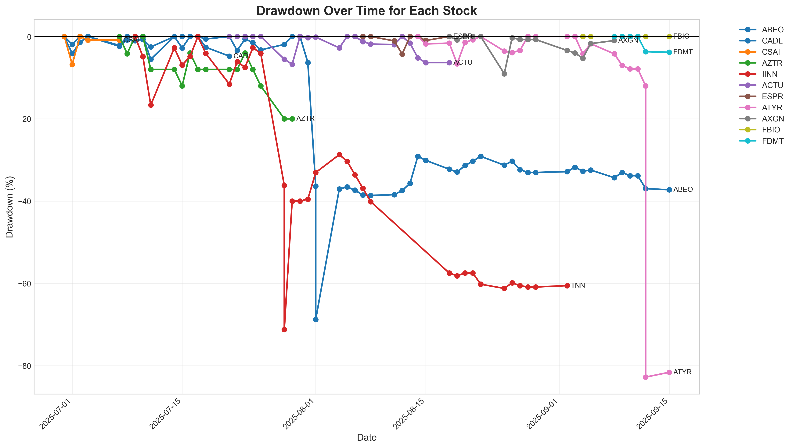

# ChatGPT Micro Cap Experiment
## Professional Financial Performance Report

**Report Date:** September 15, 2025

---
## Table of Contents

- [Executive Summary](#executive-summary)
- [Performance Analysis](#performance-analysis)
  - [Portfolio Performance vs. Benchmark](#portfolio-performance-vs.-benchmark)
  - [Daily Performance](#daily-performance)
  - [ROI Over Time](#roi-over-time)
  - [Individual Stock Drawdowns](#individual-stock-drawdowns)
  - [Risk-Return Profile](#risk-return-profile)
  - [Risk-Return Dashboard](#risk-return-dashboard)
  - [Cash Position Analysis](#cash-position-analysis)
- [Portfolio Composition & Allocation](#portfolio-composition-and-allocation)
  - [Current Holdings Analysis](#current-holdings-analysis)
  - [Position Size Analysis](#position-size-analysis)
  - [Category Analysis](#category-analysis)
  - [Comparative Portfolio Analysis](#comparative-portfolio-analysis)
- [Risk Metrics](#risk-metrics)
- [Win/Loss Analysis](#win-loss-analysis)
  - [Win/Loss Distribution](#win-loss-distribution)
- [Detailed Position Analysis](#detailed-position-analysis)
  - [All Stocks Ever Purchased](#all-stocks-ever-purchased)
  - [Currently Held Stocks](#currently-held-stocks)
---

## Executive Summary

> **Disclaimer:** This is a 6-month live trading experiment with real money ($100 initial investment) managed by ChatGPT. Past performance does not guarantee future results. This report is for educational and research purposes only.

### Key Metrics

| Metric | Value |
|--------|-------|
| Total Portfolio Value | $84.17 |
| Trade ROI | -5.37% ($-18.11) |
| Portfolio ROI | -15.83% |
| Annualized Volatility | 93.49% |
| Sharpe Ratio | -0.26 |
| Invested Value (Holdings) | $55.75 |

## Performance Analysis

### Portfolio Performance vs. Benchmark

### Daily Performance

### ROI Over Time

### Individual Stock Drawdowns

### Risk-Return Profile

### Risk-Return Dashboard

### Cash Position Analysis

This chart shows the daily portfolio composition as a stacked bar chart, combining cash position and total stock market value. Each bar represents a trading day, with the cash position at the base and the total value of all stocks stacked on top. Value labels show the cash amount, stock value, and total portfolio value for each day. Negative cash balances indicate either additional cash was added during the period or trades were executed with margin/borrowed funds.

## Portfolio Composition & Allocation

### Current Holdings Analysis

### Position Size Analysis

### Category Analysis

### Comparative Portfolio Analysis

## Risk Metrics

### Risk Metrics Dashboard

| Metric | Value | Description |
|--------|-------|-------------|
| Average Drawdown | -23.25% | Across All Positions |
| Worst Drawdown | -82.78% | ATYR |
| Best Drawdown | 0.00% | FBIO |
| High Drawdown Stocks | 4 | >10% Drawdown |
| Sortino Ratio | -0.01 | Downside Risk-Adjusted Return |
| Max Consecutive Wins | 3 | Trading Days |
| Max Consecutive Losses | 3 | Trading Days |

## Win/Loss Analysis

### Win/Loss Metrics Dashboard

| Metric | Value | Description |
|--------|-------|-------------|
| Win Rate | 50.0% | 6/12 Positions |
| Average Win | 19.8% | Profitable Positions |
| Average Loss | -19.1% | Losing Positions |
| Best Position | 41.2% | ACTU |

### Win/Loss Distribution

## Detailed Position Analysis

### All Stocks Ever Purchased

| Ticker | Shares | Cost Basis ($) | Realized Proceeds ($) | Market Value ($) | ROI (%) | Net Gain/Loss ($) |
| --- | --- | --- | --- | --- | --- | --- |
| ACTU | 6.0 | $34.50 | $48.72 | $0.00 | 41.22% | $14.22 |
| CADL | 5.0 | $25.20 | $32.95 | $0.00 | 30.75% | $7.75 |
| CSAI | 15.0 | $28.50 | $34.20 | $0.00 | 20.00% | $5.70 |
| ABEO | 6.0 | $34.62 | $38.34 | $0.00 | 10.75% | $3.72 |
| ESPR | 2.0 | $3.82 | $4.14 | $0.00 | 8.38% | $0.32 |
| AXGN | 2.0 | $29.92 | $32.20 | $0.00 | 7.62% | $2.28 |
| SNGX | 5.0 | $14.30 | $0.00 | $13.75 | -3.85% | $-0.55 |
| FBIO | 8.0 | $29.70 | $0.00 | $28.40 | -4.38% | $-1.30 |
| FDMT | 2.0 | $14.70 | $0.00 | $13.60 | -7.48% | $-1.10 |
| IINN | 32.0 | $45.98 | $37.66 | $0.00 | -18.09% | $-8.32 |
| AZTR | 55.0 | $13.75 | $11.00 | $0.00 | -20.00% | $-2.75 |
| ATYR | 12.0 | $62.48 | $24.40 | $0.00 | -60.95% | $-38.08 |
|**TOTAL**|**150.0**|**$337.47**|**$263.61**|**$55.75**|**-5.37%**|**$-18.11**|

### Currently Held Stocks

| Ticker | Shares | Cost Basis ($) | Realized Proceeds ($) | Market Value ($) | ROI (%) | Net Gain/Loss ($) |
| --- | --- | --- | --- | --- | --- | --- |
| SNGX | 5.0 | $14.30 | $0.00 | $13.75 | -3.85% | $-0.55 |
| FBIO | 8.0 | $29.70 | $0.00 | $28.40 | -4.38% | $-1.30 |
| FDMT | 2.0 | $14.70 | $0.00 | $13.60 | -7.48% | $-1.10 |
|**TOTAL**|**15.0**|**$58.70**|**$0.00**|**$55.75**|**-5.03%**|**$-2.95**|

## Footer

ChatGPT Micro Cap Experiment | Professional Financial Report | Generated on 2025-09-16 14:31:26

This report is automatically generated and should be reviewed by a qualified financial professional before making investment decisions.
